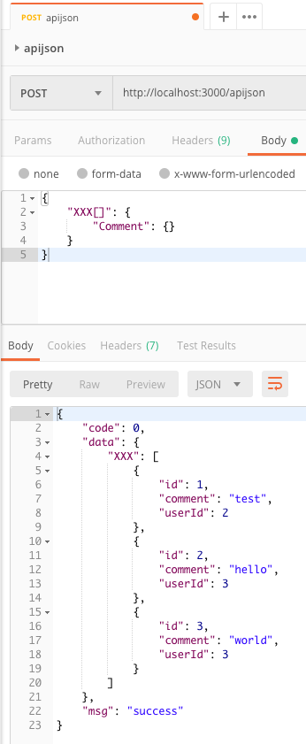
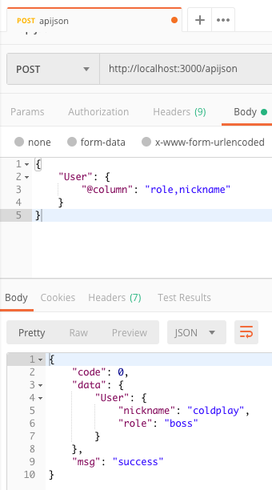
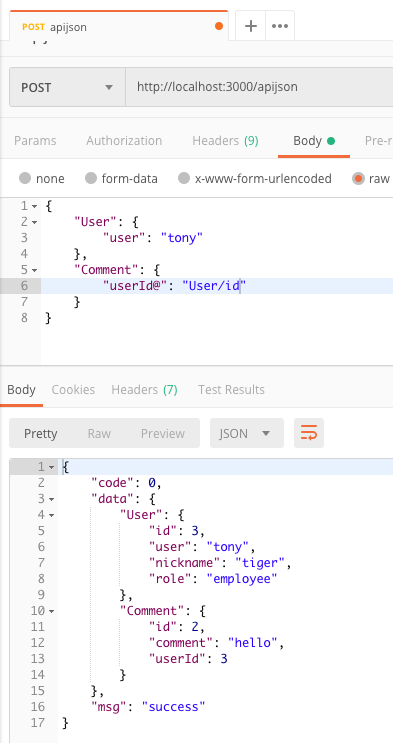
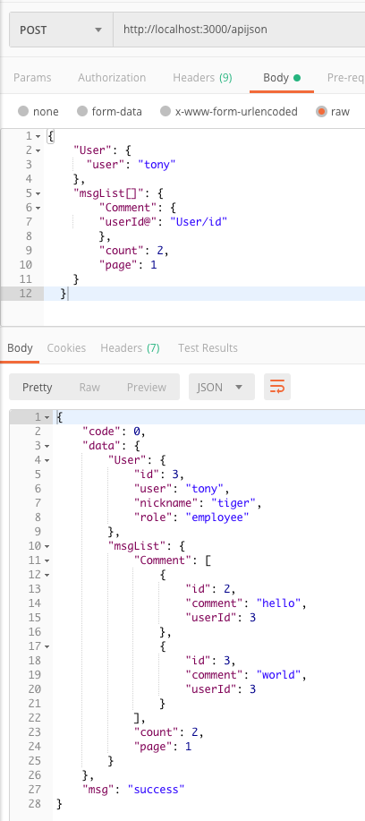
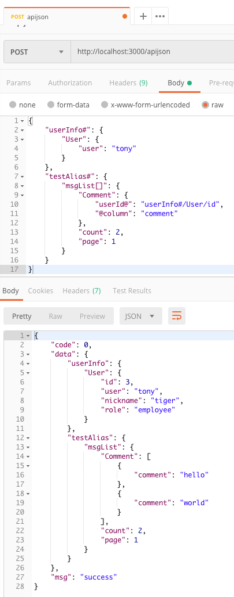

# ApiJson Node版

> ### A ApiJson Server build with Nest.js and TypeORM

----------

# 起步

## 安装依赖

    
```bash
$ npm install
```

----------

## Database数据库配置

修改 `ormconfig.js` 参照 `ormconfig.js.example`

测试数据库为 `apijson.sql`, 如需体验可自行导入本地数据库测试

    {
      "type": "mysql",
      "host": "localhost",
      "port": 3306,
      "username": "",
      "password": "",
      "database": "",
      "entities": ["src/**/**.entity{.ts,.js}"],
      "synchronize": false
    }

----------

## NPM 命令

- `npm run dev` - 开发模式
- `npm start` - 启动应用
- `npm run start:prod` - 生产模式

----------

## 启动应用

- `npm start`
- 健康检查 `http://localhost:3000/test` 正常情况下会返回 `ok`
- 使用 `pm2` 可以直接 用 `pm2 start ./pm2.config.json` 启动

----------
 
# Swagger API 文档

This example repo uses the NestJS swagger module for API documentation. [NestJS Swagger](https://github.com/nestjs/swagger) - [www.swagger.io](https://swagger.io/)        

# 使用文档

> 以下例子中 默认存在两张表（Comment， User）


已经实现的操作符

- 单条记录查询

  ```json
  {
      "Comment": {
        "User": {}
      }
  }
  ```

- []

  操作符名称： 列表查询

  例子：

    ```json
      // 这里[]前的字符串将作为response的字段名
      {
        "XXX[]": {
          "Comment": {}
        }
      }
    ```
  
- \#

  操作符名称： 别名

  例子：

    ```json
    {
      "SingleComment#": {
        "Comment": {}
      }
    }
    ```

- @column

  操作符名称： 字段筛选

  例子：

  ```json
  {
    "User": {
      "@column": "role,nickname"
    }
  }
  ```

  


- 联表查询

  例子：
  ```json
  // 查询叫tony的User
  // 查询一条userId为User中id的Comment
  {
    "User": {
      "user": "tony"
    },
    "Comment": {
      "userId@": "User/id"
    }
  }
  ```
  

  ```json
  // 查询所有符合条件的comment 显示 第1页 每页2条
  // (因为默认page = 1 count = 10 所以默认最多为10条)
  {
    "User": {
      "user": "tony"
    },
    "msgList[]": {
    	"Comment": {
        "userId@": "User/id"
	    },
	    "count": 2,
	    "page": 1
    }
  }
  
  ```
  


- 综合例子

	```json
	{
	  "userInfo#": {
	    "User": {
	      "user": "tony"
	    }
	  },
	  "testAlias#": {
	    "msgList[]": {
	      "Comment": {
          "userId@": "userInfo#/User/id",
          "@column": "comment"
	      },
	      "count": 2,
	      "page": 1
	    }
	  }
	}
	```

  
