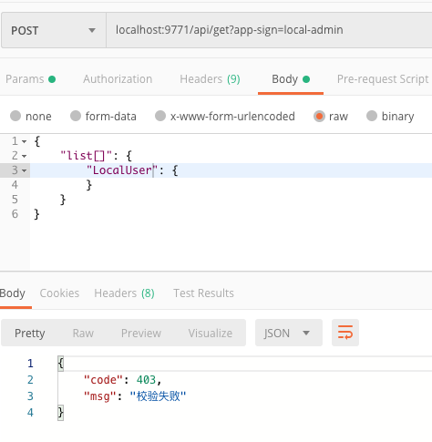
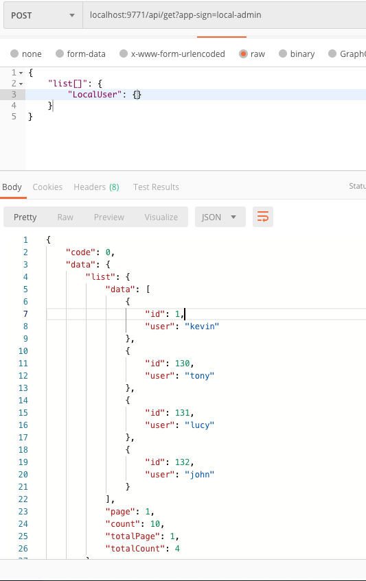

# ApiJson Node版

> ### A ApiJson Server build with Nest.js and TypeORM

----------

# 启动项目


1.安装依赖

```shell
$ npm install
```

安转不上可以使用cnpm

2.启动项目

```shell
$ npm run dev
```


3. 默认端口9771  打开 http://localhost:9771/

  默认账号 admin/admin


4.测试接口

```shell
curl --location --request POST 'localhost:9771/api/get?app-sign=local-admin' \
--header 'Content-Type: application/json' \
--data-raw '{
    "list[]": {
    	"LocalUser": {}
    }
}'
```
app-sign也可放在header里

```shell
curl --location --request POST 'localhost:9771/api/get' \
--header 'Content-Type: application/json' \
--header 'app-sign: local-admin' \
--data-raw '{
    "list[]": {
    	"LocalUser": {}
    }
}'
```




因为设置了校验中间件 随机返回403

正常返回结果如下




5.配置其他数据库

- 权限管理>数据库管理>添加数据库

- `测试连接`

- `添加表`

- 点击 `写入配置`

6.配置表权限

- 权限管理>表管理>配置表权限角色

- `部署所有表配置`

- `热重启` (热重启是针对pm2启动的，如果是npm run dev启动的可自行重启)

7.配置角色

- 角色包含的是上述中的表的权限的集合

8.配置应用

- 应用管理>新增应用

- 应用可以配置多个角色，自定义逻辑

9.其他文档, 请点击`文档`

10.数据统计可点击左上角`APIJSON`,统计最近7天数据

